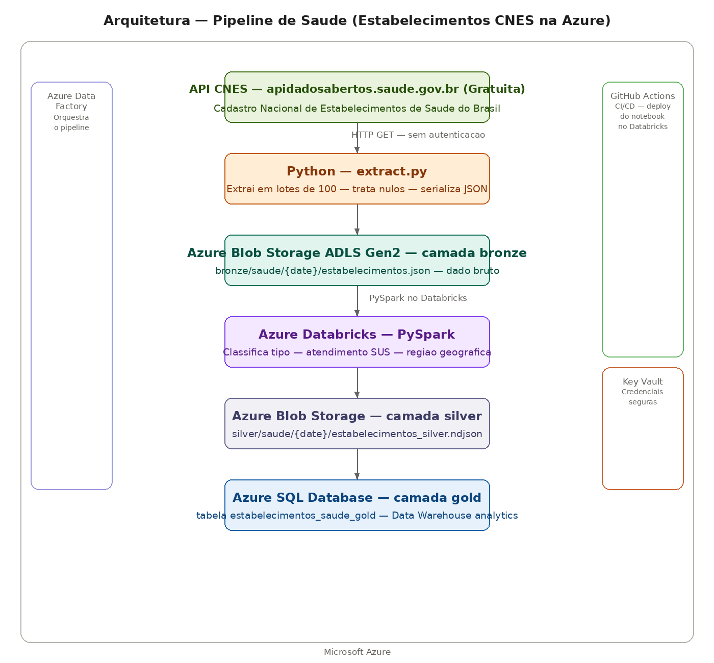

# Pipeline de Saúde — Estabelecimentos CNES na Azure

Pipeline de dados que extrai o Cadastro Nacional de Estabelecimentos de Saúde (CNES) do Ministério da Saúde, aplica medallion architecture com camadas bronze, silver e gold usando Microsoft Azure com PySpark no Databricks.

## Arquitetura



**Ingestão:** Script Python extrai estabelecimentos de saúde de todo o Brasil via API oficial do CNES — hospitais, clínicas, UBSs, consultórios — sem necessidade de autenticação.

**Bronze:** Dados brutos em JSON preservados no Azure Blob Storage com ADLS Gen2 — garantindo reprocessamento sem nova chamada à API.

**Silver:** Notebook PySpark no Azure Databricks transforma os dados — classifica o tipo de estabelecimento (hospital, cirúrgico, ambulatorial), identifica atendimento SUS e classifica por região geográfica. Salvo como NDJSON no Blob Storage.

**Gold:** Dados modelados carregados no Azure SQL Database via conector nativo do Spark — prontos para consultas SQL analíticas.

**Credenciais:** Azure Key Vault armazena todas as credenciais de forma segura.

**CI/CD:** GitHub Actions deploya automaticamente o notebook PySpark no Databricks a cada push na pasta functions/.

**Infraestrutura:** Toda infraestrutura provisionada via Terraform — Resource Group, Blob Storage ADLS Gen2, Azure Synapse Analytics, Key Vault e Data Factory.

## Dados extraídos

Mais de 300 mil estabelecimentos de saúde cadastrados no CNES — incluindo:
- Hospitais gerais e especializados
- Unidades Básicas de Saúde (UBS)
- Policlínicas e centros de especialidade
- Consultórios e clínicas privadas
- Serviços de apoio diagnóstico

## Tecnologias Azure

| Serviço | Função | Equivalente AWS | Equivalente GCP |
|---|---|---|---|
| **Azure Blob Storage ADLS Gen2** | Data Lake bronze e silver | S3 | Cloud Storage |
| **Azure Databricks** | PySpark distribuído | EMR | Dataproc |
| **Azure SQL Database** | Data Warehouse gold | RDS | Cloud SQL |
| **Azure Synapse Analytics** | Analytics workspace | Redshift | BigQuery |
| **Azure Key Vault** | Credenciais seguras | Secrets Manager | Secret Manager |
| **Azure Data Factory** | Orquestração | MWAA | Cloud Composer |
| **GitHub Actions** | CI/CD | CodePipeline | Cloud Build |
| **Terraform** | Infraestrutura como código | Terraform | Terraform |

## Medallion Architecture

**Bronze (Blob Storage ADLS Gen2):** JSON bruto exatamente como veio da API — estrutura original preservada para reprocessamento.

**Silver (Blob Storage NDJSON):** Uma linha por estabelecimento com classificações calculadas — tipo de estabelecimento, atendimento SUS e região geográfica.

**Gold (Azure SQL Database):** Tabela `estabelecimentos_saude_gold` pronta para consultas analíticas SQL.

## Transformações PySpark — camada silver

- **tipo_estabelecimento** — hospital, cirurgico, ambulatorial ou outros
- **atende_sus** — sim ou nao
- **regiao** — Norte, Nordeste, Sudeste, Sul ou Centro-Oeste com base no código UF

## Resultado da extração — distribuição por região

| Região | Estabelecimentos |
|---|---|
| Sudeste | 46% |
| Sul | 22% |
| Nordeste | 20% |
| Norte | 8% |
| Centro-Oeste | 4% |

## Queries no Azure SQL Database

```sql
-- Distribuicao por tipo de estabelecimento
SELECT tipo_estabelecimento, COUNT(*) as total
FROM estabelecimentos_saude_gold
GROUP BY tipo_estabelecimento
ORDER BY total DESC;

-- Estabelecimentos que atendem SUS por regiao
SELECT regiao, COUNT(*) as total
FROM estabelecimentos_saude_gold
WHERE atende_sus = 'sim'
GROUP BY regiao
ORDER BY total DESC;

-- Hospitais por estado
SELECT codigo_uf, COUNT(*) as total_hospitais
FROM estabelecimentos_saude_gold
WHERE tipo_estabelecimento = 'hospital'
GROUP BY codigo_uf
ORDER BY total_hospitais DESC;
```

## Como rodar

### 1. Criar infraestrutura Azure
```bash
az login
cd terraform
terraform init
terraform apply
```

### 2. Configurar secrets no Databricks
```bash
databricks secrets create-scope --scope licitacoes
databricks secrets put --scope licitacoes --key storage-key-caged --string-value "<storage-key>"
databricks secrets put --scope licitacoes --key sas-token-caged --string-value "<sas-token>"
```

### 3. Rodar extração
```bash
export AZURE_STORAGE_CONNECTION_STRING="<connection-string>"
python functions/extract/extract.py
```

### 4. Rodar transformação
Execute o notebook `transform_saude` no Azure Databricks.

## Autor

**Lucas Magalhães** — Engenheiro de Dados

[](https://github.com/lucasmagalhaess)
[](https://linkedin.com/in/lucasmagalhaes-data)
